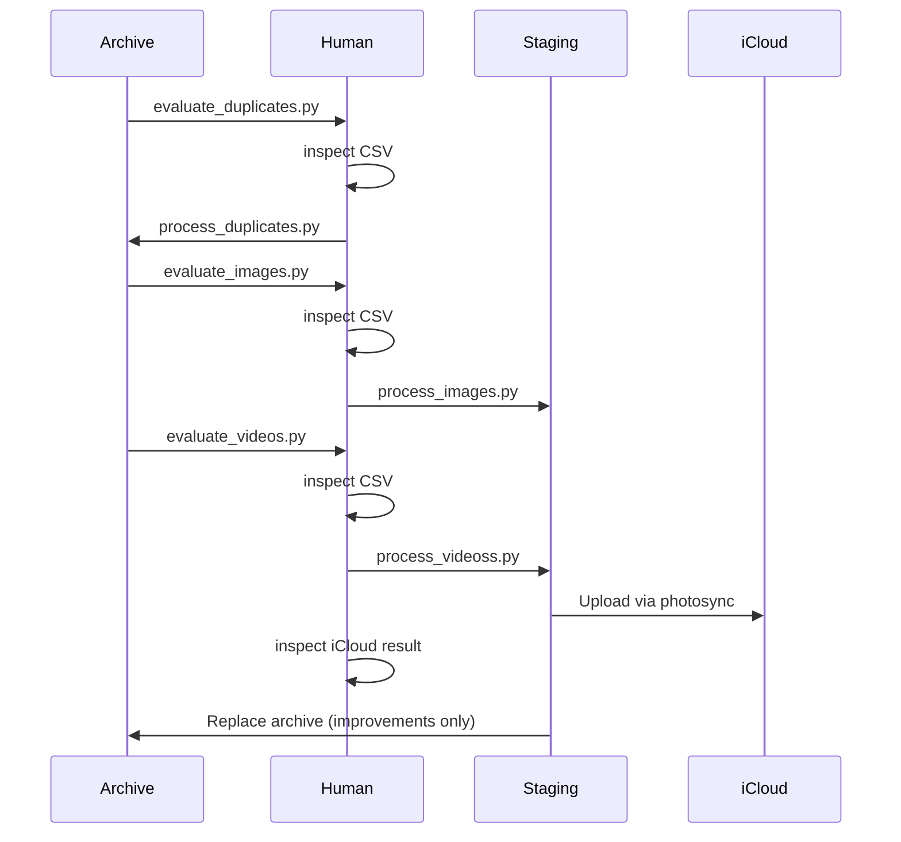

# icloud_reingest
Reingest curated and archived media into iCloud

<!-- TOC -->
* [icloud_reingest](#icloud_reingest)
  * [Introduction](#introduction)
  * [Critical Notes](#critical-notes)
  * [How to install this tool?](#how-to-install-this-tool)
  * [How to use this tool?](#how-to-use-this-tool)
    * [Image processing](#image-processing)
    * [Video procesing](#video-procesing)
    * [Reingestion into iCloud](#reingestion-into-icloud)
    * [Overwriting archived media with converted media](#overwriting-archived-media-with-converted-media)
  * [Author](#author)
<!-- TOC -->

## Introduction
The workflow below has a critical flaw:
1. Capture photos and videos on your iPhone or iPad
2. Sync them to iCloud
3. Periodically off-load them to your pc for curating and archival

**Curated media are not available on your iPhone or iPad. Instead these devices are stuck with the raw unfiltered media.**

This tool creates a way to reingest curated and archived media back into iCloud so they are available on your devices again.
As a result the following steps are added to the workflow:

4. Define a transition date (earlier than the latest offloading cutoff date)
5. Remove all media from iCloud that is older than the transition date
6. Reingest curated and archived media back into iCloud up to the transition date

This creates an iCloud media collection that has curated images before the transition date and unfiltered ones after.
Visually that looks like this:

```
|<-- Curated and archived media -->|<-- Raw unfiltered media -->|
```
Subsequent offloading and curating can continue as normal.
When the next reingestion is done, the transition date is moved forward in time.

```
|              25    26    27    28                |              
|<-- Curate  -->|<-- Raw media -->|
|<-- Curate       -->|<-- Raw media -->|
|<-- Curate             -->|<-- Raw media -->|
|<-- Curate                   -->|<-- Raw media -->|
```


## Critical Notes
* Media are reingested with their original creation dates so they appear in the correct chronological order in iCloud.
If the correct date can't be found in the metadata, or there are reasons to believe the file modified date is wrong, the media file is skipped.

## Overal workflow (visual)


## How to install this tool?
```python
poetry install --no-root
```
## How to use this tool?
### Archive image deduplicaiton
Remove duplicate images in the archive before reingestion to save iCloud space. Based on pHash algorithm.
1. Run the deduplication script to find duplicate images in the archive
```python
# configure the python file first!
python src\evaluate_duplicates.py
```
2. Evaluate the csv file (use excel). Make manual changes if desired.
3. Run the script to remove duplicate images from the archive
```python
# configure the python file first!
python src\process_duplicates.py
```

### Image processing
Filter and copy the archive images to reingest into iCloud.
1. Generate a report of the picture media
```python
# configure the python file first!
python src\evaluate_image_files.py
```
2. Evaluate the csv file (use excel). Make manual changes if desired.
3. Process the report so images to reingest are stored in a new flat location
```python
# configure the python file first!
python src\process_image_files.py
```
### Video procesing
Filter, convert and copy the archive videos to reingest into iCloud.
1. Generate a report of the video media
```python
# configure the python file first!
python src\evaluate_video_files.py
```
2. Evaluate the csv file (use excel). Make manual changes if desired.
3. Process the report so videos to reingest are stored in a new flat location
```python
# configure the python file first!
python src\process_video_files.py
```
### Reingestion into iCloud
1. Reingest the curated media into iCloud via an intermediary device using PhotoSync
2. Evaluate results on iPhone and iCloud web.

### Overwriting archived media with converted media
If you have converted media (e.g. new video files), it could be usefull to replace the originals with the converted ones.
In the case of a x264 --> x265 conversion, this will save file size. 
Module `process_video_files.py` will have generated a csv report with the mapping between original and converted files.
You can use the `replace_archived_media.py` script to do the replacement in iCloud
1. Add a column 'overwrite' to the csv report with value 1 for original files to replace with the converted ones.
2. Run the script
```python
# configure the python file first!
python src\replace_archived_media.py
```

## Author
Jorrit Vander Mynsbrugge